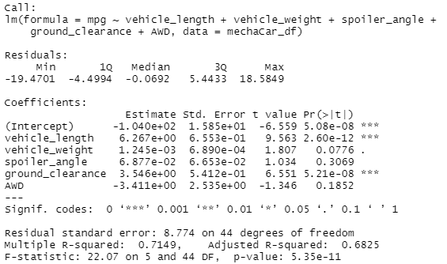
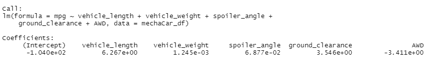
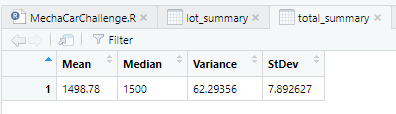
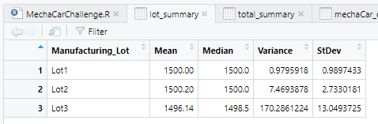
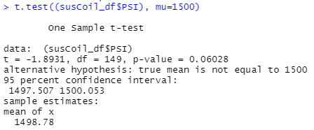
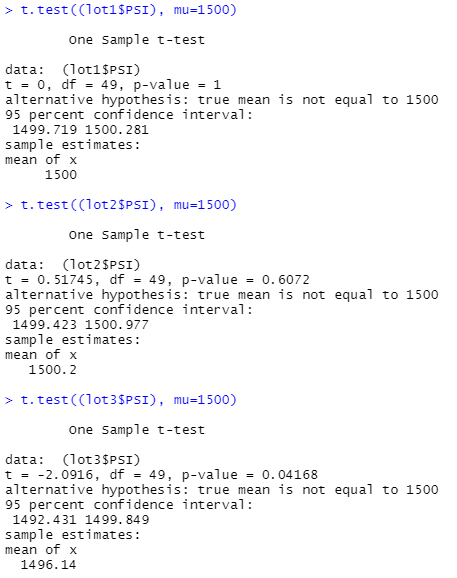

# MechaCar_Statistical_Analysis

## Linear Regression to Predict MPG

When looking to see which variables are truly affecting the variance in the mpg values, we are examining p-values. P-value tells us the likelihood that we would see similar results if we tested again. A variable with a low p-value is unlikely to provide random amounts of variance, meaning that variable has a significant impact on the mpg. 
Let us make a list from least to greatest and translate the scientific notation values into decimals to better compare them:

vehicle_length:   0.000000000026
ground_clearance: 0.00000052
vehicle_weight:   0.078
AWD:              0.19
spoiler_angle:    0.3069

As seen above, vehicle_length and ground_clearance are the 2 variables that provided a significant non-random amount of variance in the mpg values of the dataset.
________________________________________________________________________________

When written out, our linear regression line is y=6.26x1 + .001245x2 +.06877x3 + 3.546x4 + -3.411x5 + -.0104. From calculus we know that the derivative of a line is its slope. When we take the derivative, we get y=6.26 + .001245 +.06877 + 3.546 + -3.411 which simplifies to 6.465015. This is a positive, non-zero slope.
________________________________________________________________________________
This linear model is not effective in predicting MechaCar prototypes because the p-value of our y-intercept is .0000005 which means there is a significant amount of variability in our dependent variable. The significance of the y-intercept along with the significance of the vehicle_length and the ground_clearance mean that our model needs some scaling to be better at predicting.
________________________________________________________________________________

## Summary Statistics on Suspension Coils
According to the design specifications for the MechaCar suspension "coils dictate that the variance of the suspension coils must not exceed 100 pounds per square inch." When we look at the variance of all the lots together we see that the variance is at 62.29 which satisfies the requirements.

However, the table below shows the variance when we look at each individual lot, and we can tell that Lot3 fails to meet the requirements.

## T-Test on Suspension Coils
A t-test is used to determine whether there is a statistical difference between the means of a dataset and a another. The first image below shows the results for a t-test on the PSI across all manufacturing lots as compared to the population mean of 1500 pounds per square inch.  

Assuming our significance is 0.05 percent, we can see that the p-value is higher and therefore, the population mean and the mean our lots are statisticallly similar.The next image below shows the results for a t-test on the PSI across each manufacturing lot (there are 3) as compared to the population mean of 1500 pounds per square inch.  

For lot1, we can see the p-value is 1, which suggests there is statistically no difference between it and the population mean. For lot2, the p-value is higher than 0.05 and therefore, the population mean and the mean of this lot are statisticallly similar. Lastly is lot3, which has a p-value less than 0.05. Lot3 is not statistically similar to our population mean. 

## Design a Study Comparing the MechaCar to the Competition

Proposal: 
- Let us compare the MechaCar to our competitors, by comparing engine life. 
- The null hypothesis is that our cars have the same engine life as other companies. The alternative hypothesis is that our cars have a different engine life (hopefully longer) than the competition. 
- The statistical test we will use is the pair t-test because it compares two samples between different populations to see if they are statistically similar or not.
- The data we will need is a sample of 1,000 MechaCars engine life length in miles. All cars usually have a warranty for the first 100,000 miles, and on average most cars last at least 200,000 miles. Time to start testing!